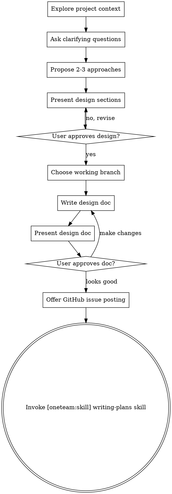

# Brainstorming Ideas Into Designs

## Overview

Turn ideas into designs through collaborative dialogue. Explore context, ask questions one at a time, propose approaches, get design approval, then hand off to planning.

<HARD-GATE>
Do NOT invoke any implementation skill, write any code, scaffold any project, or take any implementation action until you have presented a design and the user has approved it. This applies to EVERY project regardless of perceived simplicity — "simple" projects are where unexamined assumptions cause the most wasted work. The design can be short (a few sentences for truly simple projects), but you MUST present it and get approval. **The terminal state is invoking [oneteam:skill] `writing-plans`.** Do NOT invoke any other implementation skill.
</HARD-GATE>

## When to Use

- Starting a new feature or component
- Modifying existing behavior
- Any creative work requiring design decisions

## When NOT to Use

- Bug fix with clear symptoms -- use [superpowers:skill] `systematic-debugging`
- Task already has a detailed plan -- skip to implementation
- Pure refactoring with no behavior change

## TaskList

1. **Explore project context** -- files, docs, recent commits.
2. **Ask clarifying questions** -- one at a time; purpose, constraints, success criteria.
3. **Propose 2-3 approaches** -- trade-offs and your recommendation.
4. **Present design** -- sections scaled to complexity; approve after each.
   After each section: `"Look right, or any changes?"`
   After final section: `"Full design above. Approve to continue?"`
5. **Choose working branch** -- via AskUserQuestion (see below).
6. **Write design doc** -- save to `plans/YYYY-MM-DD-<topic>-design.md` (do NOT commit).
7. **Present and review design doc** -- pretty-print as rendered markdown (NOT in a code block); ask for changes via AskUserQuestion. Loop until approved.
8. **Offer GitHub issue posting** -- optionally post design to a GitHub issue.
9. **Invoke [oneteam:skill] `writing-plans`** -- no other skill.

## Process Flow

## After the Design

### Step 5: Choose Working Branch

Run `git branch --show-current`, then `AskUserQuestion` (header: "Branch"):

| Option label | Description |
|---|---|
| Stay on `<branch>` | Continue on current branch |
| Switch to existing | User types target branch name |
| Create new branch | Suggest `feat/<topic-slug>`; user can accept or edit |

**Switch to existing**: `git checkout <branch>`. **Create new branch**: `git checkout -b <name>`.

### Step 6: Write Design Doc

Save the full compiled design document to `plans/YYYY-MM-DD-<topic>-design.md`. Use elements-of-style:writing-clearly-and-concisely if available. Do NOT `git add` or `git commit`.

### Step 7: Present and Review Design Doc

Pretty-print the full design document as rendered markdown. Output it directly -- NOT inside a code block -- so the user sees formatted headings, bold text, bullets, etc.

`AskUserQuestion` (header: "Review"):

| Option label | Description |
|---|---|
| Looks good | Proceed to GitHub issue posting |
| Make changes | User provides feedback; incorporate it, update the file, and re-present |

If "Make changes": incorporate the user's feedback, revise the document, update the file at the same path, and present the updated document again. Repeat until approved.

### Step 8: GitHub Issue Posting

`AskUserQuestion` (header: "GitHub issue"):

| Option label | Description |
|---|---|
| Post to GitHub issue | Post design as new or existing issue |
| Skip | Go straight to planning |

If accepted:

1. **Repository** -- always ask, NEVER assume current repo. `AskUserQuestion` (header: "Repository"):

   | Option label | Description |
   |---|---|
   | This repo (`<owner/repo>`) | Current working directory's repo |
   | Different repo | User types `owner/repo` or URL |

2. **New or existing issue.** `AskUserQuestion` (header: "Issue"):

   | Option label | Description |
   |---|---|
   | New issue | Create with design topic as title |
   | Existing issue | Comment on existing (user provides number) |

   New: `gh issue create -R owner/repo --title "<topic>" --body "..."`. Existing: `gh issue comment NUMBER -R owner/repo --body "..."`. Always use `-R`.

## Quick Reference

| Step | Action | Gate |
|------|--------|------|
| 1 | Explore project context | -- |
| 2 | Ask clarifying questions (one at a time) | -- |
| 3 | Propose 2-3 approaches with trade-offs | -- |
| 4 | Present design sections | User approves each section |
| 5 | Choose working branch | User selects via AskUserQuestion |
| 6 | Write design doc to `plans/` | -- |
| 7 | Present and review design doc | User approves via AskUserQuestion |
| 8 | Offer GitHub issue posting | User opts in/out |
| 9 | Invoke [oneteam:skill] `writing-plans` | Terminal state |

## Common Mistakes

| Mistake | Fix |
|---------|-----|
| Asking multiple questions at once | One question at a time |
| Jumping to implementation before design approval | Hard gate -- present design and get explicit approval |
| Invoking a skill other than `writing-plans` at the end | `writing-plans` is the only valid terminal state |
| Proceeding past review without user approval | Step 7 is an approval gate -- present the doc and wait for explicit approval before continuing |

## Constraints

- ALWAYS ask one question at a time; prefer multiple choice when possible
- ALWAYS propose 2-3 approaches before settling on a design
- ALWAYS present design and get explicit approval before moving on
- NEVER begin implementation until design is approved (hard gate)
- NEVER invoke any skill other than [oneteam:skill] `writing-plans` as terminal state
- NEVER proceed past the design doc review without presenting it to the user and receiving explicit approval (Step 7 approval gate)
- YAGNI ruthlessly -- cut unnecessary features from all designs
