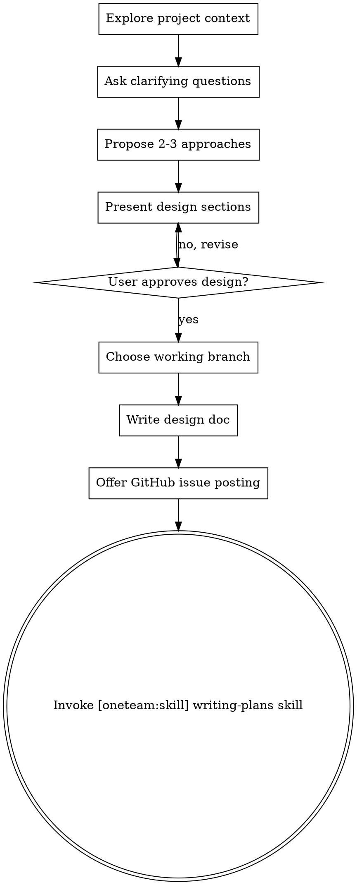

# Brainstorming Ideas Into Designs

## Overview

Help turn ideas into fully formed designs and specs through natural collaborative dialogue.

Start by understanding the current project context, then ask questions one at a time to refine the idea. Once you understand what you're building, present the design and get user approval.

<HARD-GATE>
Do NOT invoke any implementation skill, write any code, scaffold any project, or take any implementation action until you have presented a design and the user has approved it. This applies to EVERY project regardless of perceived simplicity — "simple" projects are where unexamined assumptions cause the most wasted work. The design can be short (a few sentences for truly simple projects), but you MUST present it and get approval. **The terminal state is invoking [oneteam:skill] `writing-plans`.** Do NOT invoke any other implementation skill.
</HARD-GATE>

## Checklist

You MUST create a task for each of these items and complete them in order:

1. **Explore project context** — check files, docs, recent commits
2. **Ask clarifying questions** — one at a time, understand purpose/constraints/success criteria
3. **Propose 2-3 approaches** — with trade-offs and your recommendation
4. **Present design** — in sections scaled to their complexity, get user approval after each section
5. **Choose working branch** — ask user which branch to work on via AskUserQuestion
6. **Write design doc** — save to `docs/plans/YYYY-MM-DD-<topic>-design.md` (do NOT commit)
7. **Offer GitHub issue posting** — optionally post the design to a GitHub issue
8. **Transition to implementation** — invoke [oneteam:skill] `writing-plans` skill to create implementation plan

## Process Flow

## After the Design

**Choose working branch:**

After the design is approved but before writing the design doc file, ask the
user which branch to work on. Get the current branch with
`git branch --show-current`, then present options via `AskUserQuestion`
(header: "Branch"):

| Option label | Description |
|---|---|
| Stay on `<branch>` | Continue on the current branch |
| Switch to existing | User types the target branch name |
| Create new branch | Suggest `feat/<topic-slug>` derived from the design topic; user can accept or edit |

If the user picks **Switch to existing**, run `git checkout <branch>`.
If the user picks **Create new branch**, run `git checkout -b <name>`.

**Documentation:**
- Write the validated design to `docs/plans/YYYY-MM-DD-<topic>-design.md`
- Use elements-of-style:writing-clearly-and-concisely skill if available
- Do NOT run `git add` or `git commit`. The file stays as an uncommitted local file.

**GitHub issue posting:**

After writing the design file (and before invoking [oneteam:skill] `writing-plans`), ask the user
if they want to post the design to a GitHub issue. If they decline, proceed
directly to [oneteam:skill] `writing-plans`.

If they accept:

1. **Ask which repository.** Always ask for the target repository. NEVER
   assume the current working directory's repository is the target. The user
   may respond with:
   - `same` or `current` — use the current working directory's repo
   - `owner/repo` — target that specific repo
   - A full URL — extract the repo from it

2. **Ask new issue or existing.**
   - **New issue:** `gh issue create -R owner/repo --title "<topic>" --body "..."`
     Use the design topic as the title (e.g., "Add auth flow").
   - **Existing issue:** Ask for issue number, then
     `gh issue comment NUMBER -R owner/repo --body "..."`

3. **Always use the `-R` flag.** Never run `gh issue create` or
   `gh issue comment` without `-R owner/repo`. This prevents accidentally
   targeting the wrong repository.

**Implementation:**
- Invoke the [oneteam:skill] `writing-plans` skill to create a detailed implementation plan
- Do NOT invoke any other skill. [oneteam:skill] `writing-plans` is the next step.

## Key Principles

- **One question at a time** - Don't overwhelm with multiple questions
- **Multiple choice preferred** - Easier to answer than open-ended when possible
- **YAGNI ruthlessly** - Remove unnecessary features from all designs
- **Explore alternatives** - Always propose 2-3 approaches before settling
- **Incremental validation** - Present design, get approval before moving on
- **Be flexible** - Go back and clarify when something doesn't make sense
