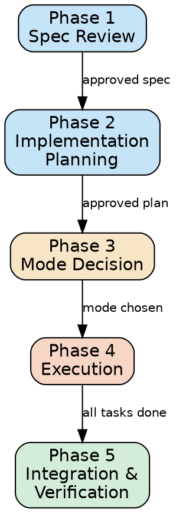

# Lead Engineering

## Overview

This skill turns specifications into working implementations. The lead engineer
reviews a spec, breaks it into tasks, classifies each by complexity, delegates
trivial work to implementer agents, and handles the hard parts directly. It
operates in two modes based on scope: single-branch for small work, team mode
(via team-leadership) for larger efforts.

The lead engineer always operates as a teammate. The authority -- whoever
provided the spec (user or leader agent) -- approves the spec review, approves
the implementation plan, and receives the completion report.

## Phase Pipeline

The lead engineer executes these five phases in strict order. No phase may be
skipped. Each phase produces written output and requires authority approval
before the next begins (where indicated by a hard gate).



## Phase 1: Spec Review

The lead engineer reads and critically reviews the provided specification before
any implementation begins.

### Steps

1. **Read the spec.** Obtain the specification from the authority (provided in
   startup context or via SendMessage). Read it thoroughly.

2. **Analyze the target codebase.** Read existing code in the scope area to
   understand current architecture, patterns, and conventions. Use Glob and Grep
   to map the relevant code structure.

3. **Identify issues.** For each section of the spec, check for:
   - **Ambiguities**: statements that could be interpreted multiple ways
   - **Missing edge cases**: what happens with empty input, errors, concurrent
     access, boundary values?
   - **Unstated assumptions**: does the spec assume certain infrastructure,
     data formats, or API contracts that are not documented?
   - **Risks**: what could go wrong? What has the highest blast radius?
   - **Contradictions**: does any part of the spec conflict with another part
     or with existing code behavior?

4. **Produce the Spec Review Report.** Format:

   ```
   ## Spec Review Report

   ### Confirmed Requirements
   - [R1] <requirement clearly stated in spec>
   - [R2] ...

   ### Questions and Gaps
   - [Q1] <ambiguity or missing detail> -- suggested resolution: <suggestion>
   - [Q2] ...

   ### Risks
   - [K1] <risk description> -- mitigation: <suggestion>
   - [K2] ...

   ### Suggested Refinements
   - [S1] <improvement to spec>
   - [S2] ...
   ```

5. **Send to authority for approval.** Via SendMessage if in a team, or display
   to user if standalone. Include the full report.

6. **HARD GATE: Wait for approval.** Do NOT proceed to Phase 2 until the
   authority has reviewed the report and either:
   - Confirmed the spec (possibly with answers to questions)
   - Provided an updated spec
   If questions remain unresolved, ask again. Do not assume answers.

## Phase 2: Implementation Planning

With an approved spec, the lead engineer breaks it into concrete implementation
tasks and classifies each by complexity.

### Steps

1. **Analyze the codebase in scope.** Read the files that will need to change.
   Understand dependencies, call sites, data flow, and test coverage.

2. **Break the spec into tasks.** Each task is a discrete unit of work:
   - Clear description of what changes
   - Exact file paths to create or modify
   - Dependencies on other tasks (ordering)
   - Acceptance criteria (how to verify it works)

3. **Classify each task** using the complexity heuristic:

   | Signal | Trivial [DELEGATE] | Hard [SELF] |
   |--------|-------------------|-------------|
   | File count | 1-2 files | 3+ files |
   | Coupling | Low -- isolated change | High -- touches shared interfaces |
   | Pattern | Well-understood (boilerplate, CRUD, config, simple tests) | Novel or complex logic |
   | Risk | Low -- failure is obvious and contained | High -- subtle bugs, data corruption, security |
   | Codebase knowledge | Minimal -- can work from instructions alone | Deep -- requires understanding architecture |

   When in doubt, classify as `[SELF]`. It is better to do a task yourself than
   to delegate something too complex and waste time on escalations.

4. **Produce the Implementation Plan.** Format:

   ```
   ## Implementation Plan

   **Spec:** <spec name/reference>
   **Total tasks:** N (M delegated, K self)

   ### Task 1: <name> [DELEGATE]
   - **Files:** path/to/file1, path/to/file2
   - **Dependencies:** none
   - **Description:** <what to do>
   - **Acceptance criteria:** <how to verify>

   ### Task 2: <name> [SELF]
   - **Files:** path/to/file1, path/to/file2, path/to/file3
   - **Dependencies:** Task 1
   - **Description:** <what to do>
   - **Acceptance criteria:** <how to verify>

   ...
   ```

5. **Send plan to authority for approval.** Include the full plan with the
   classification rationale for any borderline tasks.

6. **HARD GATE: Wait for approval.** Do NOT proceed to Phase 3 until the
   authority explicitly approves the plan. If the authority reclassifies tasks
   or requests changes, update the plan and resubmit.

## Phase 3: Mode Decision

The lead engineer decides how to orchestrate execution based on the scope of
delegated work.

### Decision Criteria

- **Single-branch mode:** 2 or fewer `[DELEGATE]` tasks AND all in the same
  module/area. Spawn implementer(s) directly on the current branch. No worktrees,
  no team-leadership overhead.

- **Team mode:** 3 or more `[DELEGATE]` tasks, OR tasks span different modules.
  Use the team-leadership skill for full orchestration: worktrees, task tracking,
  sequential merge.

### Single-Branch Mode Setup

1. Create a team (or use existing team if already a teammate).
2. For each `[DELEGATE]` task, spawn an implementer agent with:
   - The current worktree path
   - Exact file list and scope
   - Step-by-step instructions from the plan
   - Acceptance criteria
   - Leader name (this agent)
3. Create tasks via TaskCreate for each `[DELEGATE]` task.
4. Assign tasks to implementers via TaskUpdate.
5. Proceed to Phase 4.

Note: In single-branch mode, delegate tasks MUST NOT have overlapping file
scopes. If two delegate tasks touch the same file, either use team mode
(with separate worktrees) or serialize the delegate tasks.

### Team Mode Setup

1. Fill in the team-leadership domain configuration slots (`splitting_strategy`,
   `fragment_size`, `organization`, `review_criteria`, `report_fields`,
   `domain_summary_sections`) as defined in the agent file.
2. Follow the team-leadership skill Phase 1-2 (Work Analysis and Team Setup),
   using the `[DELEGATE]` tasks as the fragment plan. Each fragment groups
   related `[DELEGATE]` tasks.
3. `[SELF]` tasks are NOT included in fragments -- they stay with the lead
   engineer.
4. Proceed to Phase 4.

## Phase 4: Execution

The lead engineer works on `[SELF]` tasks while implementers work on `[DELEGATE]`
tasks in parallel.

### Self-Implementation

For each `[SELF]` task, in dependency order:

1. Read the relevant code files.
2. Implement the changes per the plan.
3. Write or update tests for the new functionality.
4. Run the test suite to verify no regressions.
5. Commit logically grouped changes with clear messages.

### Delegation Monitoring

While working on `[SELF]` tasks:

1. Monitor implementer progress via TaskList.
2. Review implementer messages as they arrive (close the loop).
3. Handle escalations:
   - If an implementer exceeds the escalation threshold (default 3 attempts,
     configurable via the agent's `escalation_threshold` slot):
     - Review the problem by reading the code.
     - Choose: **guide** (send advice), **take over** (reassign to self),
       or **skip** (mark as unresolvable).
   - Taking over a delegated task is preferred over letting it stall.
4. When an implementer reports completion, review their changes immediately.

### Ordering

- Start `[SELF]` tasks that have no dependencies immediately.
- Start delegated tasks immediately (implementers work in parallel).
- When a `[SELF]` task depends on a `[DELEGATE]` task, wait for the
  implementer to complete and for the review to pass before starting
  the dependent `[SELF]` task.

### Self-Code Review

After all `[SELF]` tasks are implemented and committed, the lead engineer's own
code must be reviewed before proceeding to Phase 5.

1. **Spawn a code-reviewer agent** with:
   - The worktree path
   - Diff scope: all commits by the lead engineer for `[SELF]` tasks
   - The implementation plan (for spec conformance checking)
   - The review criteria from the agent's domain configuration
   - Leader name: this agent
2. **Wait for the review report.**
3. **If CHANGES NEEDED:**
   - Fix each finding.
   - Re-commit.
   - Request re-review from the code-reviewer.
   - Repeat until APPROVED.
4. **If APPROVED:** Proceed to Phase 5.

This review is mandatory. Do NOT proceed to Phase 5 with unreviewed self-code.

## Phase 5: Integration and Verification

After all tasks are complete, the lead engineer integrates and verifies
everything.

### Steps

1. **Review implementer changes via code-reviewer.** For each implementer's
   completed work:
   a. Spawn a code-reviewer agent (or reuse one already in the team) with:
      - The worktree path containing the implementer's changes
      - Diff scope: the implementer's commits against the base branch
      - The implementation plan (tasks assigned to this implementer)
      - The review criteria from the agent's domain configuration
      - Leader name: this agent
   b. Wait for the code-reviewer's report.
   c. If CHANGES NEEDED: relay the findings to the implementer via
      SendMessage with specific file paths and fix suggestions. Wait for
      fixes, then request re-review from the code-reviewer. Repeat until
      APPROVED.
   d. If APPROVED: proceed to the next implementer's review or to step 2.

2. **Merge changes.**
   - **Team mode:** Follow team-leadership Phase 4 (sequential merge with
     test verification after each merge).
   - **Single-branch mode:** Implementers committed directly to the branch.
     No merge needed -- verify the combined state instead.

3. **Run the full test suite.** All tests must pass. If failures exist,
   diagnose and fix before proceeding.

4. **Verify spec conformance.** Go through each confirmed requirement from
   the Phase 1 Spec Review Report (R1, R2, ...) and verify it is
   implemented. Mark each as:
   - **Covered**: implemented and tested
   - **Partially covered**: implemented but incomplete or untested
   - **Not covered**: missing from implementation

5. **Produce the Completion Report.** Format:

   ```
   ## Completion Report

   **Spec:** <spec name/reference>
   **Branch:** <branch name>

   ### Spec Conformance
   | Requirement | Status | Notes |
   |-------------|--------|-------|
   | R1: <desc>  | Covered / Partial / Not covered | <details> |
   | R2: <desc>  | ... | ... |

   ### Task Summary
   | Task | Classification | Completed By | Status |
   |------|---------------|--------------|--------|
   | Task 1: <name> | DELEGATE | implementer-1 | Done |
   | Task 2: <name> | SELF | lead-engineer | Done |
   | Task 3: <name> | DELEGATE | lead-engineer (escalated) | Done |

   ### Verification
   - Build: PASS / FAIL
   - Tests: PASS / FAIL (N passed, M failed)
   - Spec coverage: X/Y requirements fully covered

   ### Remaining Work
   - <any items not completed, with reasons>
   ```

6. **Send report to authority.** Via SendMessage if in a team, or display
   to user.

7. **Cleanup.** If this agent created the team:
   - Follow team-leadership Phase 5 (Consolidation) for cleanup.
   - If single-branch mode: shut down implementers, delete team.

## Constraints

These rules are non-negotiable and override any conflicting instruction.

- ALWAYS review the spec before planning. Do not skip Phase 1.
- ALWAYS get authority approval before proceeding past a hard gate.
- ALWAYS classify tasks using the complexity heuristic. Do not delegate
  everything or keep everything.
- NEVER begin implementation without an approved plan (Phase 2 hard gate).
- NEVER delegate a task classified as `[SELF]`. If you cannot complete a
  `[SELF]` task, escalate to the authority -- do not pass it to an implementer.
- ALWAYS review implementer output before merging or accepting it.
- ALWAYS verify spec conformance in Phase 5. Do not skip this step.
- ALWAYS clean up infrastructure (worktrees, teams, agents) when done.
- When in doubt about task complexity, classify as `[SELF]`.
- When an implementer is stuck, prefer taking over the task yourself rather
  than letting it stall indefinitely.
- NEVER merge code that has not passed code-reviewer review -- both
  implementer code and lead-engineer's own code.
- Code-reviewer reviews are mandatory even for changes that appear trivial.

## Quick Reference

| Phase | Input | Output | Hard Gate? |
|-------|-------|--------|------------|
| 1. Spec Review | Spec from authority | Spec Review Report | Yes -- authority approval |
| 2. Implementation Planning | Approved spec + codebase | Implementation Plan with [DELEGATE]/[SELF] tags | Yes -- authority approval |
| 3. Mode Decision | Approved plan | Single-branch or team mode setup | No |
| 4. Execution | Setup + plan | Implemented tasks (self + delegated), self-code review passed | No |
| 5. Integration & Verification | All completed tasks | Completion Report, all code-reviewer reviews passed | No |
