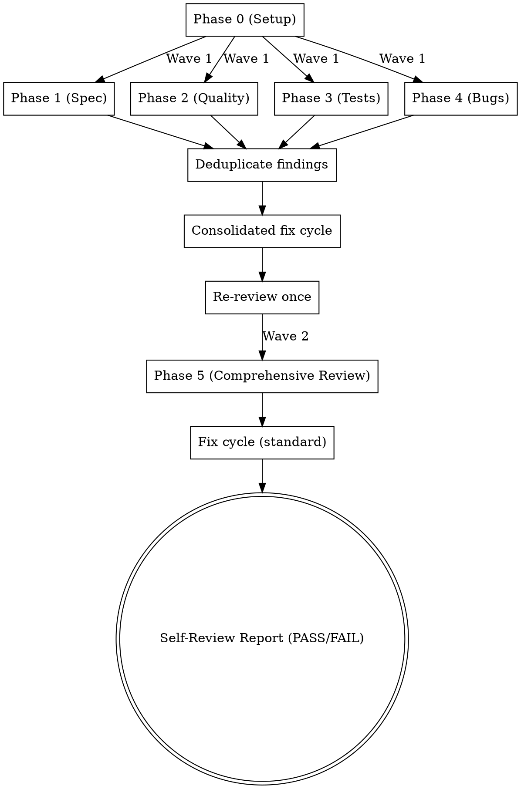

# Self-Review

## Overview

A 5-phase review pipeline that spawns specialized reviewer and engineer
subagents. Phases 1-4 run in parallel (Wave 1) with a consolidated fix cycle,
followed by Phase 5 (Wave 2) which runs after Wave 1 completes. Produces a
Self-Review Report with a PASS/FAIL verdict. This is a pre-review quality pass;
external code review is still required before merge.

## When to Use

- Before creating a PR or merging (quality gate)
- On-demand for a thorough review of the current branch

## When NOT to Use

- For external code review — self-review is a pre-filter, not a replacement
- For reviewing specs — use [oneteam:skill] `spec-review`

## Phase 0: Setup

1. **Diff scope.** If the caller provided a base branch, use it. Otherwise,
   detect it: examine git log to find the most likely base branch.
   `AskUserQuestion` (header: "Base branch"):

   | Option label | Description |
   |---|---|
   | `<detected-branch>` | Use the detected base branch (recommended) |
   | Other branch | User types the target branch name |

   If "Other branch": ask for the branch name.
   Default diff: `git diff <base-branch>...HEAD`
2. **Spec reference.** Use caller-provided spec/design doc/issue link. If not
   provided, `AskUserQuestion` (header: "Spec reference"):

   | Option label | Description |
   |---|---|
   | Provide reference | User enters a spec, design doc, or issue link |
   | Skip | Infer intent from commits in Phase 1 |

   If "Provide reference": ask for the spec, design doc, or issue link.
3. **Capture initial diff.** Store for Wave 1 (Phases 1-4 all review this same
   diff). Wave 2 re-captures the diff after Wave 1 fixes are applied.

## Pipeline

### Architecture



### Phases

| Phase | Focus | Reviewer | Finding Prefix | Severity Map |
|-------|-------|----------|----------------|--------------|
| 1 | Spec Compliance | code-reviewer | SC- | Critical / Important / Minor |
| 2 | Code Quality | code-reviewer | CQ- | Critical / Important / Minor |
| 3 | Test Comprehensiveness | code-reviewer | TC- | Critical / Important / Minor |
| 4 | Bug Hunting | [oneteam:agent] `bug-hunter` | F | HIGH / MEDIUM / LOW |
| 5 | Comprehensive Review | code-reviewer | CR- | Critical / Important / Minor |

### Wave 1: Parallel Review (Phases 1-4)

All 4 reviewer subagents launch **in parallel** on the same initial diff from
Phase 0. Each focuses only on its concern and ignores all others.

### Phase-Specific Notes

**Phases 1-3** each instruct the reviewer to focus ONLY on that phase's concern
and ignore all others. Specific review scopes:

- **Phase 1:** Does the implementation match the spec (or inferred intent)?
  Provide spec reference or instruct reviewer to infer from commits.
  See `./phase-1-spec-compliance.md` for dispatch template.
- **Phase 2:** Conventions, naming, structure, security, error handling, OWASP
  top 10, DRY violations, dead code.
  See `./phase-2-code-quality.md` for dispatch template.
- **Phase 3:** Missing test cases, edge cases, untested error paths, boundary
  conditions, integration gaps, pesticide paradox.
  See `./phase-3-test-comprehensiveness.md` for dispatch template.

**Phase 4 exceptions:** Uses [oneteam:agent] `bug-hunter` with the full 6-phase
[oneteam:skill] `bug-hunting` pipeline instead of code-reviewer. In the Wave 1
consolidated re-review, one code-reviewer checks all fixes including Phase 4
findings. If Phase 4 findings need standalone re-verification outside the
consolidated cycle, reproduction tests only are run — not the full pipeline.
Findings without reproduction tests still count toward the verdict — HIGH or
MEDIUM untested findings trigger FAIL the same as unresolved tested findings.
See `./phase-4-bug-hunting.md` for dispatch template.

### Deduplication

After all Wave 1 subagents return:

1. **Group by file:line.** If multiple phases flagged the same file:line, merge
   into a single finding. Keep the highest severity. Combine descriptions,
   preserving phase prefixes (e.g., merging `[SC-1]` and `[CQ-3]` into
   `[SC-1/CQ-3]`).
2. **Detect overlapping descriptions.** If two findings on nearby lines (within
   5 lines) describe the same issue, merge them.
3. **Sort.** Group by file, then by line number within each file.

### Consolidated Fix Cycle (Wave 1)

1. Dispatch one engineer to fix all deduplicated Wave 1 findings.
   [oneteam:agent] `senior-engineer` if any finding is
   Critical/Important/HIGH/MEDIUM, [oneteam:agent] `junior-engineer` if all are
   Minor/LOW. See `./engineer-fix-findings.md` for dispatch template.
2. Re-review once with updated diff — one code-reviewer checks all fixes.
3. Proceed to Wave 2 regardless of re-review outcome. Log any unresolved
   findings.

### Wave 2: Phase 5 (Comprehensive Review)

1. Capture updated diff (includes Wave 1 fixes).
2. Dispatch Phase 5 reviewer with the updated diff and a summary of all prior
   phase findings (Wave 1 findings + fix outcomes).
   See `./phase-5-comprehensive-review.md` for dispatch template.
3. **Phase 5** focuses on cross-cutting concerns, integration issues,
   consistency, and architectural concerns.
4. Standard fix cycle: if findings, dispatch engineer (severity-based), re-review
   once, proceed regardless.

### Finding Format

```
- [<PREFIX>1] Severity: <level> | <file>:<line> — <description>
```

Each reviewer also produces a summary with total counts and PASS/ISSUES FOUND.

## Report

See `./report-template.md` for the complete Self-Review Report template and
verdict logic.

## Constraints

Non-negotiable rules that override any conflicting instruction.

1. **Two-wave parallel** — Phases 1-4 run in parallel (Wave 1). Phase 5 runs
   after Wave 1 completes (Wave 2).
2. **One fix cycle per wave** — Consolidated fix for Wave 1, standard fix for
   Wave 2. One re-check. Log unresolved and proceed. Do NOT loop further.
3. **Severity-based engineer selection** — Critical/Important/HIGH/MEDIUM use
   [oneteam:agent] `senior-engineer`; Minor/LOW use [oneteam:agent]
   `junior-engineer`.
4. **Re-review uses updated diff** — Wave 1 re-review and Wave 2 review both
   use updated diff.
5. **Self-review does not replace external review** — This is a pre-review
   quality pass. External code review is still required before merge.
6. **No skipping phases** — All 5 phases run even if earlier phases found
   nothing.
7. **No fixing during review** — Reviewers identify issues only. Engineers fix
   issues only. Roles do not overlap.
8. **Deduplication before fix** — Merge overlapping Wave 1 findings before
   dispatching the consolidated fix.

## Quick Reference

| Step | Focus | Key Action |
|------|-------|------------|
| Phase 0 | Setup | Detect base branch, get spec reference, capture initial diff |
| Wave 1 | Phases 1-4 (parallel) | Spawn 4 reviewers in parallel on initial diff |
| Dedup | Merge findings | Group by file:line, merge overlapping, sort |
| Fix (Wave 1) | Consolidated fix | One engineer fixes all Wave 1 findings |
| Re-review | Verify fixes | One code-reviewer checks all fixes |
| Wave 2 | Phase 5 (Comprehensive) | Review updated diff with prior findings context |
| Fix (Wave 2) | Phase 5 fix | Standard severity-based fix cycle |
| Report | Verdict | Produce Self-Review Report with PASS/FAIL |

## Common Mistakes

If you catch yourself thinking any of these, stop and apply the correction.

| Rationalization | Correction |
|---|---|
| "Phase 1 found nothing, skip Phase 5" | Each phase has a different lens; comprehensive review catches cross-cutting issues |
| "Only minor issues, skip the fix" | Minor issues compound; fix while context is fresh |
| "Self-review passed, skip external review" | Self-review is a pre-filter, not a replacement |
| "The fix is trivial, skip re-review" | Trivial fixes can introduce new issues; always re-verify |
| "Tests already exist, skip Phase 3" | Existing tests may have gaps; review catches what is missing |
| "Bug-hunter found nothing, Phase 4 is done" | Verify bug-hunter completed all 6 sub-phases; partial runs miss bugs |
| "Re-review found new issues, fix those too" | One fix cycle per wave; log new issues as unresolved and proceed |
| "Run phases sequentially to be safe" | Phases 1-4 are independent; run them in parallel (Wave 1) |
| "Skip deduplication, just fix everything" | Duplicate findings waste engineer effort and risk conflicting fixes |
| "Fix each phase's findings separately" | Wave 1 uses a consolidated fix cycle; one engineer, one pass |
