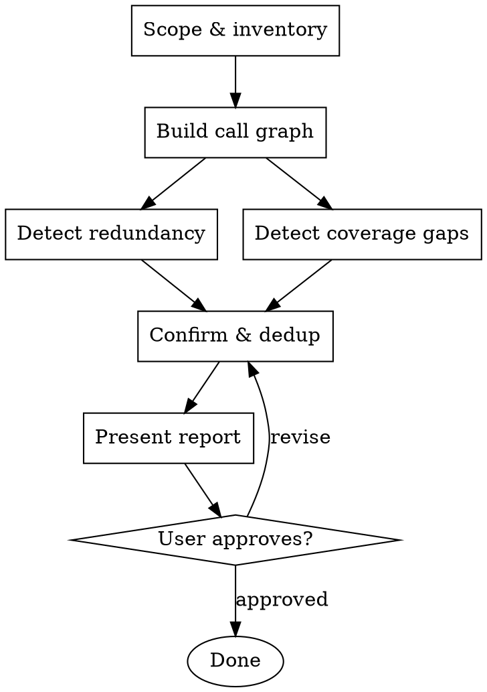

# Test Redundancy Analysis

## Overview

Analyze test suites to optimize coverage. Identifies three types of redundancy (caller/callee overlap, near-duplicates, layer overlap) with removal suggestions, and identifies coverage gaps with suggestions for new tests. Produces a structured report -- never modifies or removes test files.

**Approach:** Hybrid call graph + assertion analysis. Use the call graph to identify *where* redundancy might exist, then use assertion analysis to *confirm* it. The call graph narrows the search space so assertion analysis stays focused.

## When to Use

- Test suite has grown organically and you suspect redundancy
- Want to understand where coverage is thin vs. over-tested
- After refactoring, to check if tests are still minimal and complete
- Before a test cleanup sprint

## When NOT to Use

- Writing new tests from scratch -- use [oneteam:skill] `writing-tests` or test-driven-development
- Debugging test failures -- use [superpowers:skill] `systematic-debugging`

## Foundational Concepts

| Concept | Origin | Relevance |
|---------|--------|-----------|
| **Test Suite Minimization** | Academic software testing discipline | The formal discipline of eliminating redundant tests while maintaining fault detection capability. Guides the overall approach -- reduce without losing signal. |
| **Test Pyramid** | Mike Cohn, *Succeeding with Agile* | Many unit tests, fewer integration tests, minimal E2E. Layer overlap violates this distribution -- when integration tests duplicate what unit tests already prove, the pyramid inverts. |
| **Solitary vs. Sociable Tests** | Jay Fields (terminology), Martin Fowler (framework) | Solitary tests mock dependencies; sociable tests exercise real collaborators. Caller/callee overlap often arises when sociable tests re-exercise inner functions that already have thorough solitary tests. |
| **Cupcake Anti-Pattern** | Thoughtworks | Identical test logic duplicated across multiple layers (unit, integration, E2E). Each layer should verify something the layers below cannot. |

## Redundancy Types

| Type | Description | Related Concept |
|------|-------------|-----------------|
| **Caller/callee overlap** | Caller's tests re-test exact scenarios already proven by callee's unit tests | Solitary vs. Sociable Tests |
| **Near-duplicate** | Test cases within the same file testing the same function with trivially different inputs/assertions | Test Suite Minimization |
| **Layer overlap** | Integration tests that fully duplicate what unit tests already prove (no additional integration value) | Test Pyramid, Cupcake Anti-Pattern |

## Phase Pipeline

### TaskList

1. **Scope & inventory** -- discover test + production files in user-specified target.
2. **Build call graph** -- map functions to callers, tests to functions.
3. **Detect redundancy** -- three parallel detectors (caller/callee, near-duplicate, layer overlap).
4. **Detect coverage gaps** -- find untested functions and branches.
5. **Confirm & dedup** -- verify candidates, merge findings, assign confidence.
6. **Present report** -- structured report with removal suggestions and gap suggestions. **(HARD GATE)**

### Process Flow



"Detect redundancy" and "Detect coverage gaps" run in parallel from the call graph output, then merge into "Confirm & dedup".

### Phase 1: Scope & Inventory

1. **Get target scope.** Accept target from caller context (directory, module, or file path). If not provided, `AskUserQuestion` (header: "Target scope"):

   | Option label | Description |
   |---|---|
   | Directory | User provides a directory path to analyze |
   | Module | User provides a module name |
   | File path | User provides specific file path(s) |

2. **Discover files.** Use Glob and Grep to find all test files and production files within the target scope. Classify each file as test or production based on naming conventions, directory structure, and import patterns.
3. **Identify test frameworks.** Detect the test framework(s) in use (e.g., pytest, Jest, JUnit, Go testing). This is for display only -- analysis stays language-agnostic.
4. **Present inventory summary.** Report: N test files, M production files, test framework(s) detected, estimated analysis complexity (small/medium/large based on file count).

### Phase 2: Build Call Graph

1. **Parse production code.** Read each production file and build a function call graph (caller -> callee relationships). Record function definitions with file paths and line numbers.
2. **Map tests to functions.** For each test file, trace which production functions each test directly exercises (calls, invokes, or imports).
3. **Expand transitively.** If a test calls function `A()`, and `A()` calls `B()` and `C()`, record all three as covered by that test. Mark direct vs. transitive coverage.
4. **Output.** Produce a test-to-function coverage map: for each test, the set of production functions it covers (direct and transitive). For each production function, the set of tests that cover it.

### Phase 3: Detect Redundancy

Run three detectors in parallel (subagents). Each receives the coverage map from Phase 2 and reads the relevant test/production files.

#### Detector 1: Caller/Callee Overlap

For each function `A` that calls function `B`:
1. Collect all tests for `A` and all tests for `B`.
2. For each test of `A` that transitively covers `B`: compare the assertions against `B`'s direct tests.
3. If a test of `A` asserts the same behavior about `B` that `B`'s own tests already prove, flag as caller/callee overlap.

Output: list of candidate redundancies with confidence (high/medium/low).

#### Detector 2: Near-Duplicate

Within each test file:
1. Group tests by the production function they exercise.
2. Within each group, compare test pairs for assertion overlap: do two tests assert the same property with trivially different inputs (e.g., different string values that exercise the same code path)?
3. Flag test pairs where assertions overlap and inputs do not exercise distinct code paths.

Output: list of candidate redundancies with confidence (high/medium/low).

#### Detector 3: Layer Overlap

1. Classify tests as unit tests or integration tests based on file location, naming, fixtures, and whether they mock dependencies or use real ones.
2. For each integration test, identify the production functions it covers.
3. For each covered function, check if unit tests already prove the same assertions.
4. Flag integration tests that add no integration-specific value (no cross-boundary assertions, no real-dependency behavior checks) beyond what unit tests already prove.

Output: list of candidate redundancies with confidence (high/medium/low).

### Phase 4: Detect Coverage Gaps

Runs in parallel with Phase 3, using the same coverage map from Phase 2.

1. **No coverage.** Compare the coverage map against all production functions. Identify functions with zero test coverage (no test exercises them, directly or transitively).
2. **Partial coverage.** For functions with some coverage, read the implementation and identify untested branches: `if/else` paths, `switch` cases, guard clauses, catch blocks, and error paths that no test exercises.
3. **Assertion gaps.** Identify functions that are called by tests but have no assertions verifying their behavior -- calling without asserting is not coverage. Report these as `partial coverage` findings in the gap list.
4. **Produce gap list.** For each gap, include file path, function name, gap type (`no coverage` or `partial coverage`), description of what is untested, and a suggested test description.

### Phase 5: Confirm & Dedup

1. **Merge findings.** Collect all candidate redundancies from the three Phase 3 detectors and all gaps from Phase 4.
2. **Deduplicate.** If the same test was flagged by multiple detectors, merge into a single finding. Keep the most specific type. Combine reasoning from all detectors.
3. **Verify redundancy candidates.** For each redundancy candidate: re-read the test and the covering test. Confirm that the assertions truly overlap -- not just that both tests call the same function via different paths. Check that removing the flagged test would not lose any unique assertion.
4. **Assign final confidence.**
   - **`remove`** (high confidence): the covering test provably asserts the same behavior, and removing the flagged test loses no unique verification.
   - **`review`** (medium confidence): assertions overlap but there is ambiguity -- the test may cover a subtle edge case, or the covering test's assertions are not an exact superset.
   - Low-confidence candidates from Phase 3 are either promoted to `review` if re-verification in step 3 shows any assertion overlap, or dropped from the report if re-verification finds no actual overlap.
5. **Assign gap priority.**
   - **`high`**: public API functions, error paths, security-sensitive code.
   - **`low`**: internal helpers, trivial getters/setters, happy-path-only gaps in non-critical code.

### Phase 6: Present Report (HARD GATE)

Present the full report using the Report Format below. The user reviews and approves before any downstream action.

`AskUserQuestion` (header: "Redundancy analysis report"):

| Option label | Description |
|---|---|
| Approve | Accept the report as final |
| Revise | User provides feedback; return to Phase 5 to adjust findings |

**HARD GATE:** Do NOT take any action on the findings (deleting tests, writing tests) without explicit user approval of the report.

## Report Format

### Header

```
## Test Redundancy Analysis Report

**Target:** <scope analyzed>
**Summary:** N test files, M production files | X redundancies found, Y gaps found
**Test framework(s):** <detected frameworks>
```

### Section A: Redundant Tests (Removal Suggestions)

Each finding:

| Field | Content |
|-------|---------|
| **Test** | File path + test name |
| **Type** | `caller/callee` \| `near-duplicate` \| `layer-overlap` |
| **Redundant with** | The test(s) that already cover this behavior |
| **Confidence** | `remove` (safe to delete) or `review` (needs human judgment) |
| **Reasoning** | Why this test is redundant -- which assertions overlap, what the covering test proves |

### Section B: Coverage Gaps (Add Suggestions)

Each finding:

| Field | Content |
|-------|---------|
| **Function** | File path + function name |
| **Gap type** | `no coverage` \| `partial coverage` (specific branches untested) |
| **Suggested test** | Brief description of what a new test should verify |
| **Priority** | `high` (public API, error paths) or `low` (internal helpers, happy-path-only) |

### Section C: Summary

```
### Summary

- Total tests in scope: <N>
- Recommended removals: <count> (confidence: remove)
- Recommended reviews: <count> (confidence: review)
- Coverage gaps found: <count>
- Estimated net change: "Remove X tests, add Y tests"
```

## Quick Reference

| Phase | Input | Output | Key Question |
|-------|-------|--------|--------------|
| 1. Scope & Inventory | User target | File inventory + framework detection | What exactly are we analyzing? |
| 2. Build Call Graph | File inventory | Test-to-function coverage map | Which tests cover which functions? |
| 3. Detect Redundancy | Coverage map | Candidate redundancies (3 detectors in parallel) | Which tests overlap? |
| 4. Detect Coverage Gaps | Coverage map | Gap list with suggested tests | What is NOT tested? |
| 5. Confirm & Dedup | All candidates | Verified, deduplicated findings with confidence | Is each redundancy real? |
| 6. Present Report | Verified findings | Structured report for user approval | User approves before any action |

## Common Mistakes

| Mistake | Fix |
|---------|-----|
| Marking a test as `remove` without identifying the specific covering test | If you cannot point to the covering test and matching assertions, classify as `review` |
| Assuming untested functions are trivial | Flag as a coverage gap; do not assume triviality |
| Treating integration tests as always redundant with unit tests | Integration tests exercise different failure modes; check for integration-specific assertions |
| Comparing test appearance instead of assertions | Similar-looking tests may cover different edge cases; compare what is asserted, not how the test reads |
| Counting "calls function" as "covers function" | A test only covers a function if it exercises that function AND has assertions that verify its behavior |
| Deleting or modifying test files | This skill produces a report only; it never modifies or removes test files |
| Expanding scope beyond user-specified target | Only analyze files within the target; never expand scope without asking |
| Skipping Phase 5 confirmation | Every candidate must be re-verified against actual assertions before reporting |
| Proceeding past Phase 6 without user approval | Phase 6 is a hard gate; all findings must be approved before any downstream action |

## Constraints

### Iron Laws

1. **Never delete tests** -- this skill produces a report only; it never modifies or removes test files.
2. **Report before action** -- Phase 6 is a hard gate; all findings must be presented and approved before any downstream action.
3. **Conservative confidence** -- when uncertain whether a test is truly redundant, classify as `review`, not `remove`.
4. **No false coverage claims** -- a test only "covers" a function if it exercises that function's logic AND has assertions that verify its behavior (calling without asserting is not coverage).
5. **Scope boundary** -- only analyze files within the user-specified target; never expand scope without asking.

### Anti-Patterns

| Rationalization | Why it is wrong |
|----------------|-----------------|
| "This test is probably redundant, mark as remove" | If you cannot point to the specific covering test and matching assertions, it is `review` |
| "No one tests this function, it must be trivial" | Flag as a coverage gap; do not assume triviality |
| "The integration test covers everything" | Integration tests exercise different failure modes; unit tests may still be needed |
| "These tests look similar, they are duplicates" | Similar-looking tests may cover different edge cases; compare assertions, not appearance |
